# Oddtunes Project Architecture

This document provides a high-level overview of the project's structure and native integrations.

## Project Structure Graph

```mermaid
graph TD
    Root[oddtunes_app/] --> Lib[lib/ - Source Code]
    Root --> Assets[assets/ - Binaries & Media]
    Root --> Android[android/ - Native Android]
    Root --> Windows[windows/ - Native Windows]
    Root --> Tools[tool/ - CLI Debug Scripts]
    Root --> Retro[offtunes-retro-app/ - UI Reference]

    subgraph "Core Logic (lib/)"
        Lib --> Main[main.dart]
        Lib --> Services[services/ - Scrapers & Downloaders]
        Lib --> Models[models/ - Track & State Models]
        Lib --> Providers[providers/ - State Management]
        Lib --> Screens[screens/ - UI Views]
        Lib --> Core[core/ - Utils & Constants]
    end

    subgraph "Native Integrations"
        Android --> Kotlin[Kotlin Bridge]
        Android --> Chaquopy[Embedded Python 3.14]
        Windows --> Exe[yt-dlp.exe / ffmpeg.exe]
    end

    subgraph "Asset Management"
        Assets --> Binaries[binaries/ - Executables]
        Assets --> Sounds[sounds/ - UI Sound FX]
    end

    subgraph "Project Intelligence"
        Root --> Bible[PROJECT_BIBLE.md]
        Root --> State[PROJECT_STATE.md]
    end
```

## Directory Descriptions

| Directory | Purpose |
|-----------|---------|
| `lib/services/` | Pipeline logic: Spotify scraping, YouTube search, and FFmpeg processing. |
| `assets/binaries/` | External dependencies: `yt-dlp.exe` and `ffmpeg.exe`. |
| `tool/` | CLI scripts for testing individual modules (e.g., scrapers). |
| `PROJECT_BIBLE.md` | Central source of truth for schemas and pipeline specs. |
| `PROJECT_STATE.md` | Current implementation status and roadmap. |
