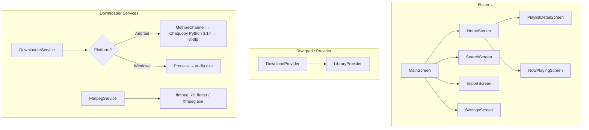

# 📻 Oddtunes

[](https://flutter.dev)
[](#)
[](#)

Oddtunes is a **cross-platform music acquisition and playback application** built with Flutter, featuring a retro-hardware-inspired UI. Import playlists from Spotify or YouTube Music, resolve each track to a YouTube audio stream, download the audio locally, automatically tag it with metadata/cover art, and play it back — all offline-first.

---

## 🎨 Retro Hardware Aesthetics

The interface is inspired by vintage, high-end audio equipment from the late 70s and 80s:
*   **Warm Color Palette:** Rich browns (`#1A0E0A`), deep crimson/velvet (`#8B2252`), and warm cream (`#F5E6D3`).
*   **LCD Display Widgets:** Using pixel-perfect monospace typography (`VT323` and `Space Mono`) to simulate retro dot-matrix hardware screens.
*   **Tactile Elements:** High-fidelity embossed panels, physical-style pressable buttons, and custom hardware sliders.
*   **Micro-interactions:** Interactive LED indicators, haptic feedback on press, and realistic click sounds.

---

## ✨ Features

*   **Playlist Portability:** Import Spotify or YouTube Music playlist/album URLs without requiring API keys.
*   **Smart Query Matching:** Features an advanced scoring algorithm (up to 115 points based on title similarity, duration match, artist matching, and video type) to find the absolute best quality audio stream on YouTube automatically.
*   **Platform-Aware Download Pipeline:**
    *   **Android:** Executes `yt-dlp` natively in a background thread via **Chaquopy** (embedded Python 3.14).
    *   **Windows:** Directly spawns and controls a background `yt-dlp.exe` process with stdout progress parsing.
*   **Instant Audio Tagging:** Uses high-performance FFmpeg stream copying to embed metadata tags (Title, Artist, Album, Track number) and high-res cover art into `.m4a` files instantly without re-encoding.
*   **Advanced Playback Engine:** Gapless playback, dynamic queue management, and background audio session control via `just_audio`.
*   **Completely Offline-First:** Scan, manage, and play your local music catalog anytime.

---

## ⚙️ Architecture & Data Flow

The application follows a clean service-oriented architecture:



---

## 🚀 Getting Started

### Prerequisites
*   [Flutter SDK](https://docs.flutter.dev/get-started/install) $\ge$ 3.11.5
*   [Java SDK 17](https://adoptium.net/) (for Android builds)
*   [Android SDK & NDK 28.x](https://developer.android.com/studio)
*   [Python 3.10+](https://www.python.org/) (installed on the build machine for Chaquopy `.pyc` compilation)

---

### 💻 Running on Windows

Because large binary executables exceed GitHub's file size limits, `ffmpeg.exe` and `yt-dlp.exe` are excluded from the repository and must be added manually before compiling:

1.  **Create the directory:**
    ```powershell
    mkdir assets/binaries
    ```
2.  **Add `yt-dlp.exe`:**
    *   Download from the [latest yt-dlp release](https://github.com/yt-dlp/yt-dlp/releases).
    *   Place it inside `assets/binaries/yt-dlp.exe`.
3.  **Add `ffmpeg.exe`:**
    *   Download a Windows build (Essentials version is recommended) from [gyan.dev](https://www.gyan.dev/ffmpeg/builds/).
    *   Extract and place the `ffmpeg.exe` binary inside `assets/binaries/ffmpeg.exe`.
4.  **Run the application:**
    ```bash
    flutter run -d windows
    ```

---

### 📱 Running on Android

Chaquopy automatically handles downloading Python and installing the `yt-dlp` library during the Gradle build step.

1.  Simply launch the application:
    ```bash
    flutter run -d <your-android-device>
    ```
    *(Note: The first compilation compiles Python modules and may take 5-10 minutes).*

---

## 📦 Key Dependencies

| Dependency | Purpose |
| :--- | :--- |
| `just_audio` | High-fidelity audio playback engine with gapless streaming |
| `flutter_riverpod` | Clean, compile-safe application state management |
| `ffmpeg_kit_flutter_new_audio` | Native FFmpeg wrapper for Android audio processing |
| `google_fonts` | Typography engine for vintage dot-matrix LCD displays |
| `audio_metadata_reader` | Read ID3 tags and metadata from saved tracks |
| `permission_handler` | Manage dynamic runtime media storage access permissions |

---

## 📝 License

This project is licensed under the MIT License - see the [LICENSE](LICENSE) file for details.
